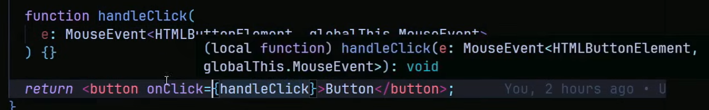

# Eventos 

Es comun que nosotros queramos usar evento ya sea de botonoes, formularios, inputs, etc y no sepamos como.

La forma mas comun y facil para no aprender es simplemente colocando el mouse sobre el evento sacandolo con una funcion como esta forma

Esta es la forma mas facil ya que funciona para cualquier evento